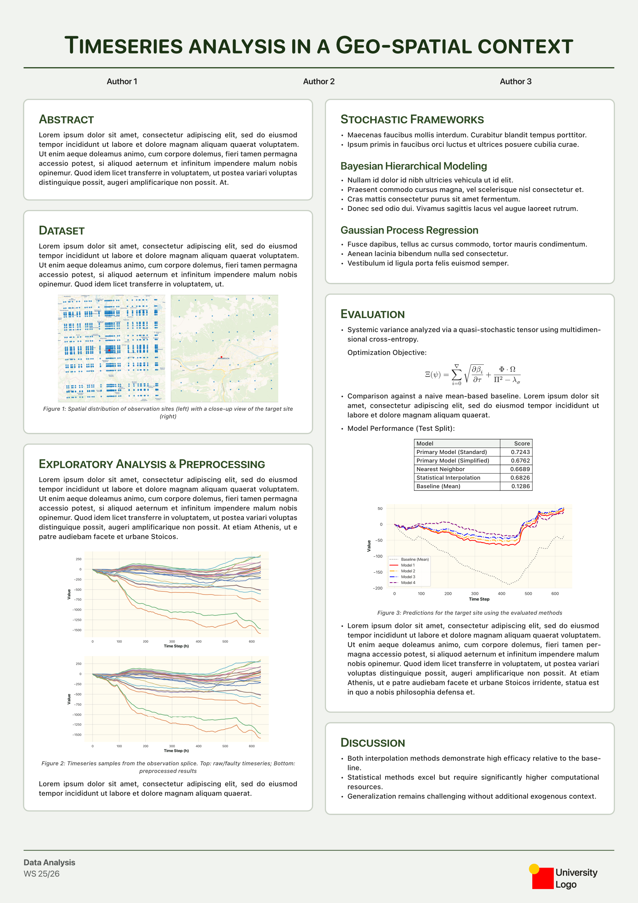
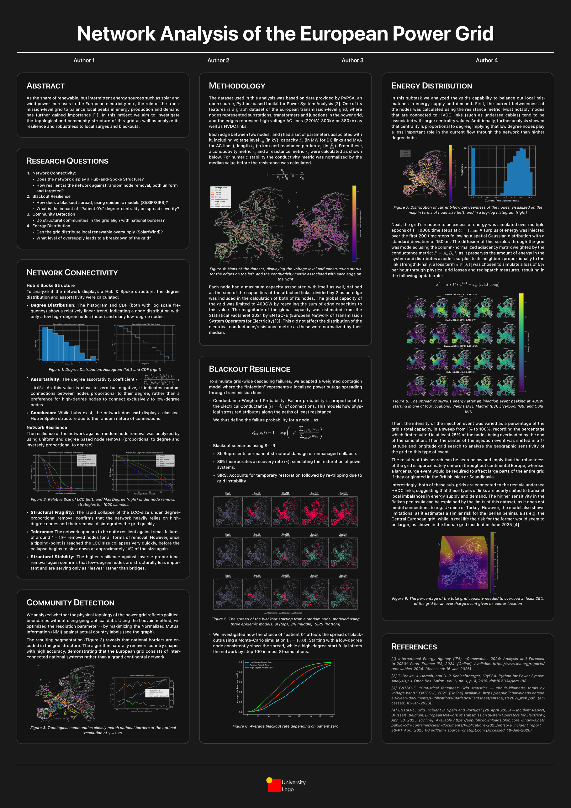

# placard

_**placard** (noun) A sign or notice for display in a public place._

A [Typst](https://typst.app/) package for creating simple posters.


```typ
#import "@preview/placard:0.1.0": placard, card
```

### Examples of posters:
---

<table>
  <tr>
    <td align="center" style="background: white; vertical-align: middle;">
      
    </td>
    <td align="center" style="background: white; vertical-align: middle;">
      
    </td>
  </tr>
</table>